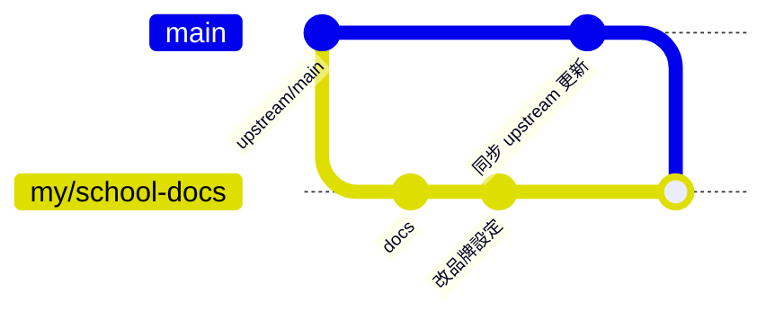

# Git 分支與上游同步流程

## 目的

本專案是 fork 自原作者的 repo。目標有兩個：

1. 把自己的修改（文件、學校品牌替換、新功能）推到自己的 fork。
2. 之後仍能持續取得原作者的更新，並把衝突控制在最小。

## 遠端配置

| 遠端 | 網址 | 權限 | 用途 |
|---|---|---|---|
| `origin` | `https://github.com/jacktea88/AI-Scholarship.git` | 可推送 | 你自己的 fork |
| `upstream` | `https://github.com/io-software-ai/NCUE-Scholarship.git` | 只拉取 | 原作者 repo |

### 為什麼要兩個遠端

- 你沒有原作者 repo 的推送權限，`origin` 必須是自己的 fork。
- Git 不會自動記住 fork 的來源；不加 `upstream`，就沒辦法取得原作者的新提交。
- 名稱 `upstream` 是慣例，方便與網路上的教學和團隊溝通對照。

設定指令（只需一次）：

```powershell
git remote add upstream https://github.com/io-software-ai/NCUE-Scholarship.git
git remote -v
git fetch upstream
```

## 分支策略



| 分支 | 內容 | 規則 |
|---|---|---|
| `main` | 與 `upstream/main` 一致 | 不直接開發，只做同步 |
| `my/*`（例如 `my/school-docs`） | 你自己的修改 | 一個主題一個分支 |

### 為什麼這樣分

- `main` 保持與原作者一致，`git merge upstream/main` 永遠是快轉（fast-forward），不會產生合併衝突。
- 衝突只會出現在「把 `main` 帶進自己的分支」這一步，範圍明確、可逐檔處理。
- 自己的修改集中在獨立分支，要回顧、拆分或丟棄都很容易，不會弄髒 `main`。
- 一個主題一個分支，之後要把某項修改提給原作者（Pull Request）時，可以只送那個分支。

## 日常流程

### 1. 開發並推送

```powershell
git switch -c my/school-docs
git add <要提交的檔案>
git commit -m "docs: 新增專案導覽與功能說明"
git push -u origin my/school-docs
```

- `add` 明確列出檔案，而不是 `git add .`：避免把個人設定（例如 `docs/AIorgInfo.code-workspace`）或 `.env` 之類的機密一起提交。
- `-u` 只需第一次使用，之後在該分支直接 `git push`。

### 2. 同步原作者更新

```powershell
git fetch upstream
git switch main
git merge upstream/main
git push origin main

git switch my/school-docs
git merge main
git push
```

| 步驟 | 為什麼 |
|---|---|
| `git fetch upstream` | 只下載，不改動任何工作目錄，可先檢查再決定是否合併 |
| `git merge upstream/main`（在 `main`） | `main` 沒有自己的提交，會直接快轉 |
| `git push origin main` | 讓你 fork 的 `main` 也保持最新 |
| `git merge main`（在自己的分支） | 把上游更新帶進自己的工作，衝突在這裡解決 |

### 3. 先看更新內容再合併

```powershell
git fetch upstream
git log main..upstream/main --oneline
git diff main upstream/main --stat
```

為什麼：上游可能改了 migration、環境變數或 API，先看過再合併，才能判斷是否需要同步調整資料庫或設定。

## merge 或 rebase

| | `merge` | `rebase` |
|---|---|---|
| 歷史 | 保留完整分支歷史，多一個 merge commit | 歷史為一直線 |
| 已推送的分支 | 安全 | 需 `git push --force-with-lease`，會改寫遠端歷史 |
| 建議 | 預設使用 | 只用於只有自己使用、想整理歷史的分支 |

本專案預設用 `merge`，因為分支會推到 GitHub，避免改寫已推送的歷史。

## 解決衝突

```powershell
git status                 # 看哪些檔案衝突
# 編輯檔案，處理 <<<<<<< ======= >>>>>>> 標記
git add <已解決的檔案>
git merge --continue
```

不確定時可用 `git merge --abort` 回到合併前的狀態。

## 減少衝突的做法

| 做法 | 為什麼 |
|---|---|
| 學校名稱、網址、連結集中改在 `packages/core/src/siteConfig.ts` 和環境變數 | 改動集中在少數檔案，上游更新其他檔案時不會衝突 |
| 新增功能盡量新增檔案，少改原作者的檔案 | 沒改到同一處就不會衝突 |
| 文件放在 `docs/` | 上游很少動這個目錄 |
| 每個分支只做一件事，並且定期同步 | 落後越久，衝突越大 |
| 不在 `main` 上開發 | 保持 `main` 可快轉 |

## 不要提交的內容

- `.env`、`.env.local`、金鑰、服務帳戶 JSON：提交後就算刪除，歷史裡仍會留下。若已誤提交，需視為外洩並重新產生金鑰。
- 個人工作區設定（例如 `docs/AIorgInfo.code-workspace`）：只有你自己需要，可加進 `.gitignore`。

## 授權提醒

本專案為 PolyForm Noncommercial 1.0.0：可修改與自用，需保留授權聲明，禁止商業使用。fork 與同步不會改變此授權。

## 目前狀態（2026-10-01）

- `main` 與 `upstream/main` 皆在 `ef80c70`，落後與領先皆為 0。
- 已推送分支：`my/school-docs`（提交 `b88d7bd`，21 個文件）。
- 上游有 tag `v2.1.0`。
