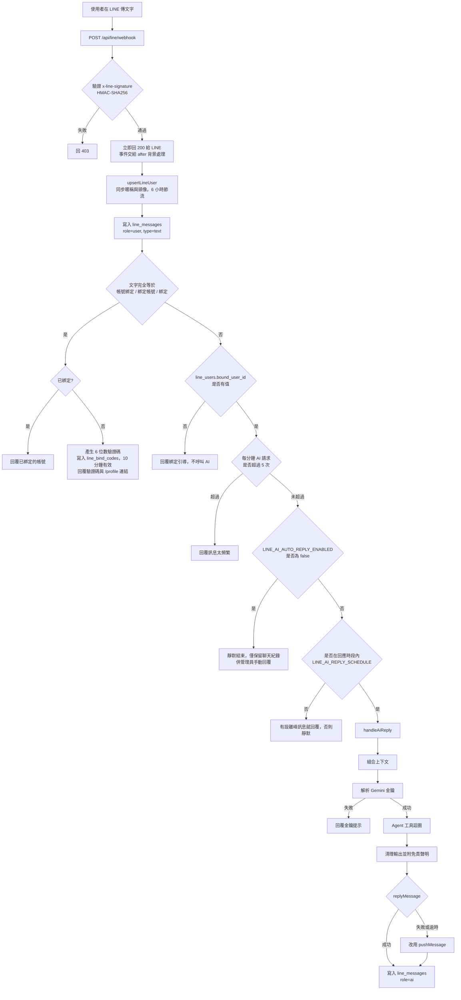

# LINE 文字訊息處理流程

依 [webhook route.js](../apps/web/src/app/api/line/webhook/route.js) 與 [agent.js](../apps/web/src/lib/ai/agent.js) 整理，說明使用者在 LINE 對官方帳號傳送文字後，系統如何處理。

## 流程圖

## 各階段說明

| 階段 | 處理內容 |
| :--- | :--- |
| 驗證 | 用 Channel Secret 驗證簽章，失敗回 403。 |
| 非同步 | 先回 200，避免 LINE 重送，再用 `after` 逐一處理事件。 |
| 記錄 | 先更新 `line_users`，再把使用者訊息存進 `line_messages`，此時後台就看得到。 |
| 綁定指令 | 只有整句完全符合關鍵字才觸發，否則一律當一般提問。 |
| 閘門 | 依序為綁定檢查、每分鐘 5 次限流（程序內記憶）、AI 開關、回應時段。 |
| 上下文 | 近 10 則 LINE 文字。若已綁定，再加上網頁版最近 10 則 `chat_history` 與 `profiles.ai_background`。 |
| 金鑰 | 彰師大學生用平台金鑰；校外使用者用自備金鑰，且必須存於雲端。 |
| Agent | 系統提示詞 `channel='line'`，最多 6 輪工具呼叫，可用公告搜尋、FAQ、訂閱、比較等工具。 |
| 輸出 | 移除卡片標記、HTML 與 Markdown，結尾附 AI 免責聲明。 |
| 回覆 | 先用 reply token，失敗才用 push，最後把 AI 回覆存進 `line_messages`。 |

## 涉及的資料表與設定

| 名稱 | 用途 |
| :--- | :--- |
| `line_users` | LINE 好友資料與 `bound_user_id`（綁定的平台帳號） |
| `line_messages` | 使用者、AI、管理員的所有 LINE 訊息 |
| `line_bind_codes` | 綁定驗證碼，10 分鐘有效 |
| `chat_history` | 網頁版對話，綁定後併入 LINE 的上下文 |
| `profiles.ai_background` | 使用者自填的背景資料 |
| `system_settings` | `LINE_AI_AUTO_REPLY_ENABLED`、`LINE_AI_REPLY_SCHEDULE`、Gemini 與 LINE 金鑰 |

## 容易忽略的行為

- 未綁定、限流、AI 關閉、時段外，這幾種情況都不會呼叫 Gemini，不產生費用。
- AI 關閉或時段外沒有離峰訊息時，使用者不會收到任何回覆。
- 上下文只取文字，圖片與貼圖不會帶入。
- 「確認訂閱」、「同意」這類同意語句，是靠模型讀對話歷史判斷，沒有獨立的狀態機。
- 限流計數存在程序記憶體中，重啟或多實例部署時不會共用。
