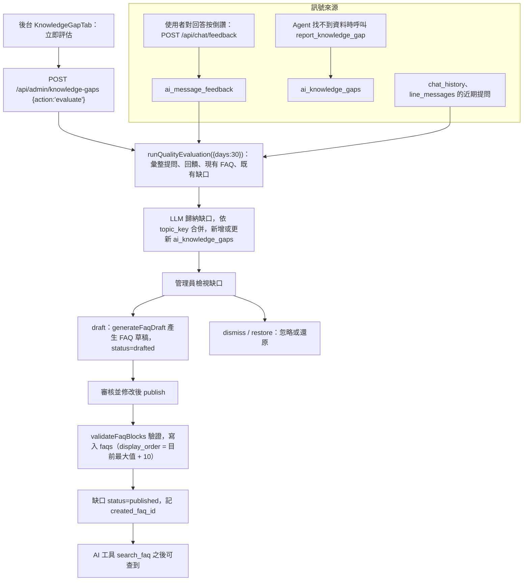

# AI 品質回饋循環

## 目的

找出「AI 答不好或找不到資料的問題」，讓管理員審核後轉成正式 FAQ，形成「使用者提問 → 缺口 → FAQ → AI 下次能答」的改善循環。

## 流程

## 涉及檔案

| 檔案 | 用途 |
|---|---|
| `apps/web/src/lib/ai/qualityEval.js` | `runQualityEvaluation`、`generateFaqDraft`、`normalizeTopicKey` |
| `apps/web/src/app/api/admin/knowledge-gaps/route.js` | `GET` 列表；`POST` 動作 `evaluate`／`draft`／`dismiss`／`restore`／`publish`；`DELETE` |
| `apps/web/src/components/admin/KnowledgeGapTab.jsx` | 後台介面 |
| `apps/web/src/app/api/chat/feedback/route.js` | 使用者回饋 |
| `apps/web/src/lib/ai/tools.js` | `report_knowledge_gap` 工具 |
| `apps/web/src/lib/faqBlocks.js` | 發佈時驗證 FAQ 內容 |
| `apps/web/supabase/migrations/20260723010000_ai_quality_loop.sql` | 相關資料表 |

## 資料表

| 表 | 用途 |
|---|---|
| `ai_message_feedback` | 使用者對單則回答的評價 |
| `ai_knowledge_gaps` | `topic_key`、`frequency`、`sample_questions`、`status`（`pending` / `drafted` / `dismissed` / `published`）、`created_faq_id` |
| `faqs` | 發佈目標（見 [常見問答FAQ.md](常見問答FAQ.md)） |
| `system_settings` | `AI_QUALITY_LAST_EVAL_AT`：增量評估游標 |

## 評估參數（`qualityEval.js`）

| 常數 | 值 | 意義 |
|---|---|---|
| `MAX_QUESTIONS` | 400 | 送進 LLM 的提問上限（成本控制） |
| `MAX_GAPS` | 12 | 單次歸納的缺口數上限 |
| `SAMPLE_CAP` | 6 | 每個缺口保留的樣本提問數 |

## 容易忽略的行為

- 評估會用 Gemini，需要平台金鑰並產生費用；只在管理員按下「立即評估」時執行。
- 資料來源同時包含網頁（`chat_history`）與 LINE（`line_messages`）。
- 已存在於 FAQ 的問題會被納入比對，避免重複建議。
- 缺口以 `normalizeTopicKey` 正規化後合併，同主題會累加 `frequency`。
- `publish` 需要管理員送出審核後的問題與答案，AI 草稿不會自動上線。
