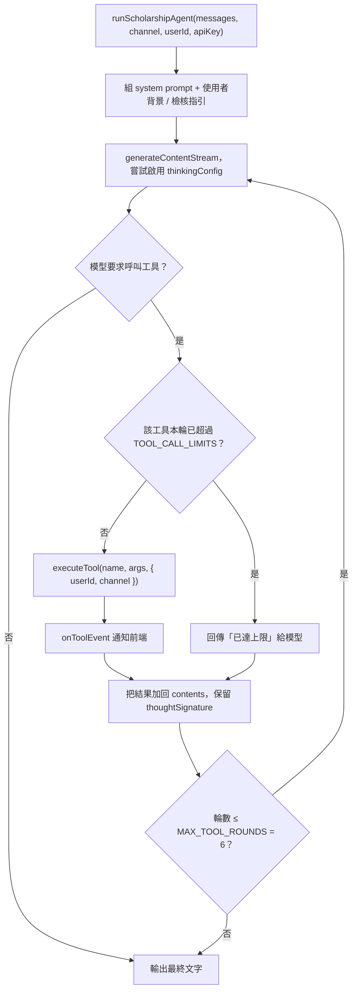

# AI 工具與 Agent 迴圈

## 目的

`lib/ai/agent.js` 讓 Gemini 以「呼叫工具 → 讀結果 → 再回答」的方式作答，網頁與 LINE 共用同一個 Agent，避免模型憑空編造獎學金資訊。

## 流程

- `runScholarshipAgent`：串流版（網頁，透過 `onText`／`onThought`／`onToolEvent`）。
- `runScholarshipAgentText`：一次回傳完整文字（LINE，預設 `channel='line'`）。
- 模型不支援 `thinkingConfig` 時會自動降級並在該程序內記住；其他錯誤（如缺 `thought_signature`）照常拋出。

## 工具清單（18 個）

| 類型 | 工具 | 說明 |
|---|---|---|
| 唯讀 | `search_scholarships`、`list_scholarships`、`get_scholarship_details` | 查 `ai_knowledge`（見 [AI知識庫同步與檢索.md](AI知識庫同步與檢索.md)） |
| 唯讀 | `search_faq` | 於 `faqs` 做關鍵字子字串比對，回傳前 4 筆 |
| 唯讀 | `get_current_date`、`get_application_checklist`、`compare_scholarships`、`get_deadline_calendar` | 日期、應備文件、比較、截止日曆 |
| 外部 | `web_search`（SerpApi）、`read_webpage` | `read_webpage` 有 SSRF 防護，只允許公開 http(s) 網址 |
| 需登入 | `list_my_subscriptions`、`subscribe_announcement`、`cancel_subscription` | 操作 `announcement_subscriptions` |
| 需登入 | `save_to_memory`、`forget_memory` | 寫入／刪除 `profiles.ai_background` |
| 需登入 | `recommend_for_me`、`get_profile_prefill` | 依使用者背景評分推薦、產生申請書預填資料 |
| 內部回報 | `report_knowledge_gap` | 記錄「資料庫找不到」的問題，進 `ai_knowledge_gaps`（見 [AI品質回饋循環.md](AI品質回饋循環.md)） |

## 單輪呼叫上限（`TOOL_CALL_LIMITS`）

`web_search` 2、`read_webpage` 3、`subscribe_announcement` 2、`cancel_subscription` 2、`forget_memory` 2、`compare_scholarships` 2、`get_deadline_calendar` 2、`recommend_for_me` 2、`report_knowledge_gap` 1、`get_profile_prefill` 1。未列出的工具不設上限（仍受總輪數 6 限制）。

## 每個工具的三個部分（`tools.js`）

1. `declaration`：給模型看的名稱、說明、參數 schema。
2. `executors[name]`：實際執行，收 `(args, context)`，`context.userId` 為 NULL 表示未登入。
3. `describeToolCall`：前端顯示的動作文字。

新增工具還要：在 `agent.js` 的 system prompt 寫使用時機；需要限制次數就加到 `TOOL_CALL_LIMITS`。完整示範見 [../LINE管理者新增公告開發指南.md](../LINE管理者新增公告開發指南.md)。

## 涉及檔案

| 檔案 | 用途 |
|---|---|
| `apps/web/src/lib/ai/agent.js` | 迴圈、system prompt、`toGeminiContents` |
| `apps/web/src/lib/ai/tools.js` | 工具宣告與執行、`executeTool`、`describeToolCall` |
| `apps/web/src/lib/ai/recommend.js` | 依縣市、科系同義詞等條件評分公告 |
| `apps/web/src/lib/ai/memory.js` | 記憶庫合併與移除（上限 `BACKGROUND_MAX = 1000` 字） |
| `apps/web/src/lib/ai/reviewGuide.js` | 文件檢核指引 |
| `apps/web/src/lib/ai/models.js` | `GEMINI_MODEL` |

## 容易忽略的行為

- 動作類工具（訂閱、記憶）在 system prompt 規定要先輸出確認標記，由使用者按按鈕確認；除非使用者以文字明確同意，模型不應直接呼叫。
- 未登入（LINE 未綁定）呼叫需登入的工具，會回傳提示訊息而非錯誤。
- 回答中的 `[ANNOUNCEMENT_CARD:…]` 等標記會在 LINE 通道被移除（`agent.js` 內以 regex 過濾），因為 LINE 沒有這些 UI。
- 工具結果會被完整送回模型，回傳內容過大會增加成本，實作時應截斷。
