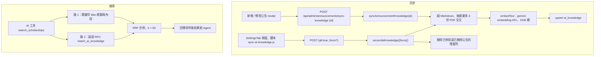

# AI 知識庫同步與檢索

## 目的

AI 不直接查 `announcements`，而是查 `ai_knowledge`：每則啟用中公告對應一筆（標題＋整理過的 Markdown 內容＋PDF 附件全文＋向量）。這樣可以統一內容格式、加入附件文字，並支援語意搜尋。

## 流程

## 涉及檔案

| 檔案 | 用途 |
|---|---|
| `apps/web/src/lib/ai/knowledge.js` | `syncAnnouncementKnowledge`、`reconcileKnowledge`、`searchKnowledge`、`embedText`、`listKnowledge` |
| `apps/web/src/app/api/admin/announcements/sync-knowledge/route.js` | `POST`：單筆 `{id}` 或全量 `{all, force}`；`GET`：檢視某筆知識內容（後台 `KnowledgeViewerModal.jsx`） |
| `apps/web/scripts/sync-ai-knowledge.js` | 命令列全量同步 |
| `apps/web/scripts/backfill-knowledge-embeddings.js`、`backfill-attachment-knowledge.js` | 補向量、補附件全文 |
| `apps/web/supabase/migrations/20260722000000_ai_knowledge_and_line.sql` | `ai_knowledge` 表 |
| `apps/web/supabase/migrations/20260723000000_pgvector_semantic_search.sql` | pgvector、HNSW 索引、`match_ai_knowledge` |

## 參數

| 常數 | 值 |
|---|---|
| `EMBEDDING_MODEL` | `gemini-embedding-001`，`outputDimensionality` 1536 |
| `MAX_PDF_PER_ANNOUNCEMENT` | 3 |
| `MAX_PDF_BYTES` | 10 MB |
| `MAX_TEXT_PER_ATTACHMENT` | 每份附件取前 5000 字 |
| RRF `K` | 60 |

## 資料表

`ai_knowledge`：`announcement_id`（唯一、`NOT NULL`、`ON DELETE CASCADE`）、`title`、`content`、`metadata`（JSONB）、`embedding`（vector 1536）、`updated_at`。

## 容易忽略的行為

- `reconcileKnowledge` 預設依 `updated_at` 增量處理；`force: true` 才會全部重建。
- 沒有套用 pgvector migration 或取不到向量時，會退回純關鍵字檢索，不會報錯。
- 知識內容含公告 UUID，這是 AI 能輸出 `[ANNOUNCEMENT_CARD:id]` 推薦卡與連結的前提。
- 公告改動後若沒有觸發同步，AI 看到的仍是舊內容；直接改資料庫時要自己跑同步。
- 只處理存放在伺服器磁碟（`public/storage/attachments/`）的 PDF；超過大小限制的檔案會被略過。
- 換金鑰或換嵌入模型後，維度不同的舊向量需用 `backfill-knowledge-embeddings.js` 重建。
