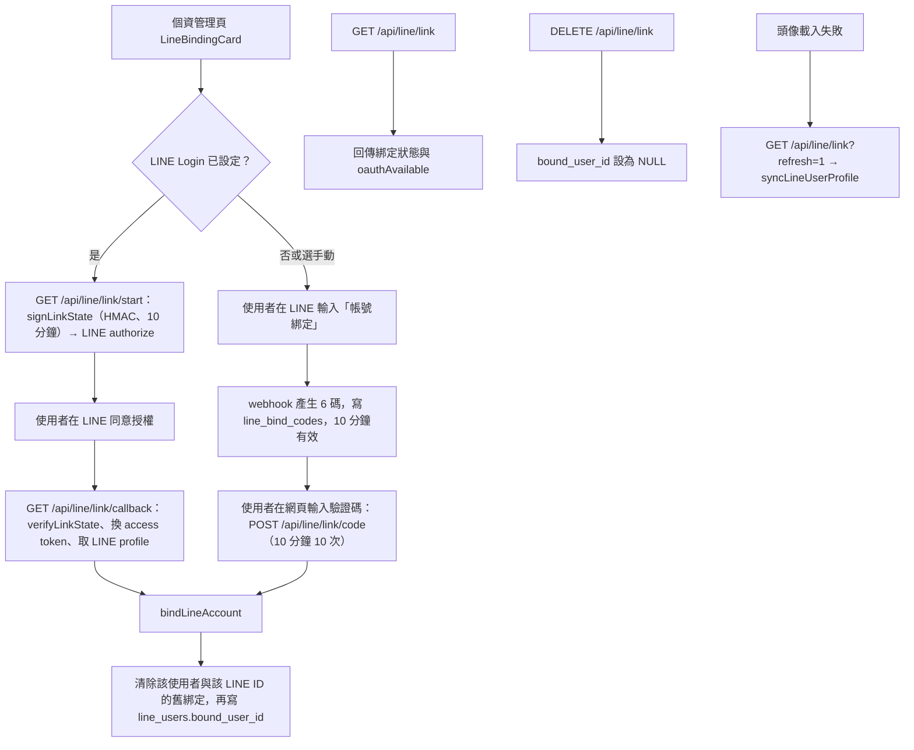

# LINE 帳號綁定

## 目的

把 LINE 好友（`line_users`）對應到平台帳號（`profiles`）。綁定後 LINE 中的 AI 助理可使用需登入的工具（訂閱、記憶、推薦），並與網頁共享對話前情。未綁定者，LINE Bot 只會回覆綁定引導（見 [../LINE文字訊息處理流程.md](../LINE文字訊息處理流程.md)）。

## 流程

## 涉及檔案

| 檔案 | 用途 |
|---|---|
| `apps/web/src/components/LineBindingCard.jsx` | 綁定介面（OAuth 按鈕、驗證碼輸入、解除綁定） |
| `apps/web/src/app/api/line/link/start/route.js` | 產生授權連結 |
| `apps/web/src/app/api/line/link/callback/route.js` | OAuth 回呼；失敗導回並帶 `reason` 參數 |
| `apps/web/src/app/api/line/link/code/route.js` | 驗證碼綁定 |
| `apps/web/src/app/api/line/link/route.js` | 狀態查詢、解除綁定、重新整理個人資料 |
| `apps/web/src/lib/lineLinkState.js` | `signLinkState`、`verifyLinkState`、`bindLineAccount` |
| `apps/web/src/lib/lineProfile.js` | `syncLineUserProfile`（更新名稱、頭像、狀態訊息） |
| `apps/web/src/app/api/line/webhook/route.js` | 「帳號綁定」「綁定帳號」「綁定」關鍵字發放驗證碼 |

## 資料表

- `line_users`：`line_user_id`、`bound_user_id`、`display_name`、`picture_url`、`status_message`。
- `line_bind_codes`：驗證碼、`line_user_id`、`expires_at`。每位好友重新索取時會先刪除舊碼。

## 設定

- `LINE_LOGIN_CHANNEL_ID`、`LINE_LOGIN_CHANNEL_SECRET`：需在 LINE Developers 另外建立「LINE Login」channel，並設定 callback URL；僅讀環境變數，不在後台設定。
- 未設定時 `oauthAvailable` 為 false，只能用驗證碼綁定。
- 狀態簽章密鑰：優先 `LINE_LOGIN_CHANNEL_SECRET`，其次 `SUPABASE_SERVICE_ROLE_KEY`。

## 安全

- `state` 以 HMAC 簽章並帶時效，防 CSRF 與重放。
- 綁定 API 需登入；驗證碼綁定有速率限制。
- `bindLineAccount` 保持 1 對 1：同一個 LINE 帳號若原本綁在別人身上，舊綁定會被清除。

## 容易忽略的行為

- LINE 頭像網址是暫時的，使用者換頭像後舊網址失效，因此前端載入失敗時才觸發 `refresh`。
- 使用者被封鎖或封鎖官方帳號時，取得 LINE profile 會失敗，資料庫舊資料保留。
- 已綁定者再輸入「帳號綁定」，Bot 會回覆已綁定，不會發新碼；要改綁需先在網頁解除。
- 註銷帳號時 `bound_user_id` 會被設為 NULL，LINE 好友與訊息紀錄仍保留。
