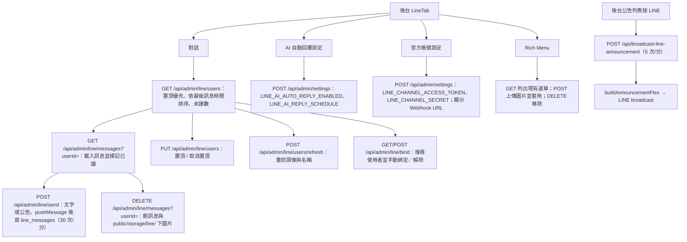

# LINE 後台管理

## 目的

管理員在後台「LINE 管理」分頁處理官方帳號：查看與回覆好友訊息、手動綁定、傳送公告、設定 Rich Menu、開關 AI 自動回覆與設定憑證。

## 流程

## 涉及檔案

| 檔案 | 用途 |
|---|---|
| `apps/web/src/components/admin/LineTab.jsx` | 全部 UI |
| `apps/web/src/app/api/admin/line/users/route.js`、`users/refresh/route.js` | 好友列表、置頂、重新整理 |
| `apps/web/src/app/api/admin/line/messages/route.js` | 訊息讀取與刪除 |
| `apps/web/src/app/api/admin/line/send/route.js` | 管理員回覆 |
| `apps/web/src/app/api/admin/line/bind/route.js` | 手動綁定／解除 |
| `apps/web/src/app/api/admin/line/richmenu/route.js`、`richmenu/image/route.js` | Rich Menu |
| `apps/web/src/app/api/broadcast-line-announcement/route.js` | 公告 Flex 廣播 |
| `apps/web/src/lib/line.js` | `getLineConfig`、`pushMessage`、`replyMessage`、`buildAnnouncementLineText`、`buildAnnouncementFlex`、`sanitizeLineUserId` |
| `apps/web/scripts/setup-line-richmenu.js` | 命令列建立 Rich Menu |

## 資料表與設定

- `line_users`：`is_pinned`、`last_message_at`、`bound_user_id`、`display_name`、`picture_url`。
- `line_messages`：`role`（`user` / `ai` / `admin`）、`message_type`、`content`、`is_read`、`created_at`。
- `system_settings`：`LINE_CHANNEL_ACCESS_TOKEN`、`LINE_CHANNEL_SECRET`、`LINE_AI_AUTO_REPLY_ENABLED`、`LINE_AI_REPLY_SCHEDULE`（見 [系統設定.md](系統設定.md)）。
- LINE Developers 後台的 Webhook URL 設為 `<你的網域>/api/line/webhook`。

## Rich Menu 規格

| 圖片尺寸 | 版型 | 按鈕 |
|---|---|---|
| 2500×1686 | 四格 | 學校網站、LINE 社群、學務處生輔組（皆為連結）、「帳號綁定」（送出文字訊息） |
| 2500×843 | 三格 | 學校網站、LINE 社群、學務處生輔組 |

- 連結來自 `siteConfig.links`，換學校要改 `packages/core/src/siteConfig.ts`，按鈕文字寫在 `richmenu/route.js`。
- 三格版型沒有「帳號綁定」按鈕，使用者需手動輸入文字。
- 套用時會先刪除所有既有 Rich Menu，再建立新的並設為所有使用者預設；也可單獨 `DELETE` 移除。

## 安全

- 全部路由 `verifyUserAuth({ requireAdmin: true })`。
- 圖片檔案路徑使用 `sanitizeLineUserId` 處理，避免路徑穿越。
- 設定讀取時憑證會遮罩。

## 容易忽略的行為

- 刪除對話會一併刪除伺服器上的圖片檔，無法復原。
- 未讀數定義為 `role='user' AND is_read=false` 的訊息數。
- 「AI 自動回覆」關閉時，LINE 訊息仍會被記錄，但不會由 AI 回覆，管理員可從此頁手動回覆。
- LINE API 錯誤多半只記錄 log 並優雅降級，不會讓整個頁面失敗。
