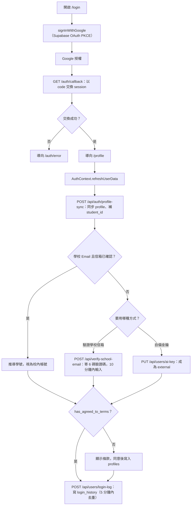

# 使用者登入與帳號驗證

## 目的

讓使用者以 Google 帳號登入，並判定帳號類型：

- 校內帳號（`ncue`）：學校 Email，自動推導學號，使用平台提供的 AI 額度。
- 校外帳號（`external`）：非學校 Email，需自備 Gemini 金鑰（見 [使用者自備金鑰BYOK.md](使用者自備金鑰BYOK.md)）。

## 流程

## 階段說明

| 階段 | 說明 |
|---|---|
| 登入 | `lib/supabase/auth.js` 的 `signInWithGoogle`；登入頁在 `app/(auth)/login/LoginClient.jsx`。 |
| 回呼 | `app/auth/callback/route.js` 交換 code；失敗（例如 code verifier 遺失）導向 `app/auth/error/page.jsx`。 |
| 學號推導 | 資料庫 trigger `derive_student_id_on_signup` 於註冊時推導；`api/auth/profile-sync` 再補寫，若學號已被其他帳號占用則略過。 |
| 帳號狀態 | `AuthContext.refreshUserData` 呼叫 `packages/core/src/aiKey.ts` 的 `resolveAccountStatus` 判斷 ncue / external 與是否已驗證。 |
| 條款 | `profiles.has_agreed_to_terms` 未勾選前不可使用功能。 |
| 登入紀錄 | `api/users/login-log` 寫入 `login_history`，並更新 `profiles.last_login_*`。 |
| 路由保護 | `apps/web/middleware.js`：未登入進入 `/profile`、`/manage`、`/management` 會導向 `/login`；已登入進入 `/login` 會導向 `/profile`。 |

## 涉及檔案

| 檔案 | 用途 |
|---|---|
| `apps/web/src/lib/supabase/auth.js` / `client.js` / `server.js` | 瀏覽器端登入、瀏覽器與伺服器（service role）Supabase client |
| `apps/web/src/contexts/AuthContext.jsx` | 全站登入狀態、`refreshUserData`、`deleteAccount` |
| `apps/web/src/app/api/auth/profile-sync/route.js` | 登入後同步 profile |
| `apps/web/src/app/api/verify-school-email/route.js` | 學校信箱驗證碼（每 IP／使用者 10 分鐘 6 次） |
| `apps/web/src/app/api/users/login-log/route.js` | 登入紀錄 |
| `packages/core/src/studentId.ts` | `deriveStudentIdFromEmail`、`isStudentEmail`、`isStudentIdFormat`（網頁與 App 共用） |
| `packages/core/src/aiKey.ts` | `resolveAccountStatus` |
| `apps/mobile/src/lib/auth.ts`、`auth-context.tsx` | App 端登入（Expo） |

## 資料表

| 表 | 重點欄位 |
|---|---|
| `auth.users` | Supabase 內建 |
| `profiles` | `student_id`（唯一）、`role`、`account_type`、`has_agreed_to_terms`、`last_login_*` |
| `school_email_codes` | 學校信箱驗證碼與到期時間 |
| `login_history` | 登入紀錄 |

## 換學校時要改的地方

- 學校信箱網域與學號格式：`packages/core/src/studentId.ts`、`derive_student_id_on_signup`（見 `apps/web/supabase/migrations/`）。
- 中介層 CORS 白名單：`apps/web/middleware.js`（目前寫死原作者網域）。
- Supabase Dashboard 需啟用 Google Provider，並設定 Redirect URL。

## 容易忽略的行為

- `middleware.js` 只檢查「有沒有登入」，不檢查角色；管理員權限由各 API 的 `verifyUserAuth({ requireAdmin: true })` 判斷。
- 學號有唯一限制，避免有人用他人學號的 Email 搶註；相關稽核見 `apps/web/scripts/audit-student-id-squatting.sql`。
- `login-log` 有 5 分鐘去重，重複整理頁面不會重複寫入。
