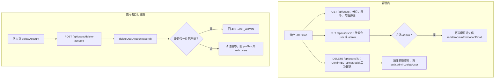

# 使用者管理與帳號刪除

## 目的

- 管理員：查詢使用者、調整角色、刪除使用者。
- 使用者：自行註銷帳號（網頁與 App 皆可）。

## 流程

## 涉及檔案

| 檔案 | 用途 |
|---|---|
| `apps/web/src/components/admin/UsersTab.jsx` | 後台使用者列表、角色切換、刪除 |
| `apps/web/src/app/api/users/route.js` | `GET` 列表（每分鐘 100 次） |
| `apps/web/src/app/api/users/[id]/route.js` | `PUT` 改角色／名稱（每分鐘 10 次）、`DELETE` 刪除 |
| `apps/web/src/app/api/users/delete-account/route.js` | 使用者自行註銷；支援 Cookie 或 `Authorization: Bearer`（App 用） |
| `apps/web/src/lib/accountDeletion.js` | `deleteUserAccount`、`assertNotLastAdmin` |
| `apps/web/src/lib/emailTemplate.js` | `renderAdminPromotionEmail` |

## 刪除時清理的資料

`deleteUserAccount` 與管理員 `DELETE` 都會處理下列關聯，因為部分外鍵沒有 `ON DELETE` 規則，不先清理會讓 `auth.admin.deleteUser` 因 FK 失敗而回 500：

| 表 | 處理 |
|---|---|
| `user_ai_keys` | 刪除 |
| `line_users.bound_user_id` | 設為 NULL（保留 LINE 好友與對話） |
| `announcement_subscriptions` | 刪除 |
| `chat_history` | 刪除 |
| `login_history` | 刪除 |
| `system_settings.updated_by` | 設為 NULL |
| `profiles` | 刪除 |
| `auth.users` | `auth.admin.deleteUser` |

## 安全與權限

- 所有管理 API 使用 `verifyUserAuth({ requireAdmin: true })`。
- 管理員不能移除自己的管理員權限（`PUT` 回 400）、不能刪除自己（`DELETE` 回 403）。
- 使用者自行註銷時，若為唯一管理員，回 409 並帶原因。

## 容易忽略的行為

- 管理員 `DELETE /api/users/:id` 沒有呼叫 `assertNotLastAdmin`，只擋「刪自己」；若要防止刪光管理員需自行補上。
- `PUT` 只接受 `role` 為 `user` 或 `admin`。
- 寄送權限通知信失敗不影響角色變更結果。
- 校外帳號清除自備金鑰時會連帶註銷帳號（見 [使用者自備金鑰BYOK.md](使用者自備金鑰BYOK.md)）。
