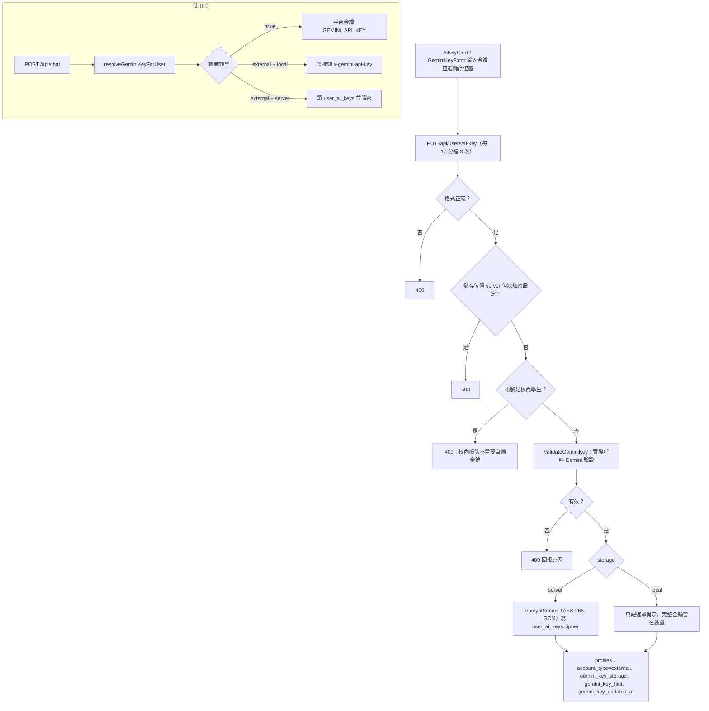

# 使用者自備金鑰（BYOK）

## 目的

校內學生使用平台的 Gemini 金鑰；非校內使用者（`external`）需自備 Google AI Studio 的 Gemini 金鑰才能用 AI 功能，讓平台不必替校外使用者付費。

## 流程

## 涉及檔案

| 檔案 | 用途 |
|---|---|
| `apps/web/src/app/api/users/ai-key/route.js` | `GET` 狀態、`PUT` 設定／更換、`DELETE` 清除（需 `{ confirm: true }`） |
| `apps/web/src/lib/ai/userKey.js` | `resolveGeminiKeyForUser`、`getAiKeyState`、`describeAiKeyState`、`validateGeminiKey`、`readKeyFromRequest` |
| `apps/web/src/lib/aiKeyClient.js` | 本機儲存與 `aiKeyHeaders`（附帶 `x-gemini-api-key`） |
| `apps/web/src/lib/secretBox.js` | `encryptSecret`、`decryptSecret`、`isSecretBoxReady` |
| `apps/web/src/components/ai-key/AiKeyCard.jsx`、`GeminiKeyForm.jsx` | 設定介面 |
| `packages/core/src/aiKey.ts` | `normalizeGeminiKey`、`isLikelyGeminiKey`、`maskGeminiKey`、`resolveAccountStatus`、`KEY_STORAGES`（網頁與 App 共用） |
| `apps/mobile/src/lib/geminiKey.ts`、`components/AiKeySection.tsx`、`GeminiKeyForm.tsx` | App 端 |
| `apps/web/supabase/migrations/20260728000000_external_byok_accounts.sql` | `user_ai_keys` 與 profiles 欄位 |

## 資料表

- `user_ai_keys`：`user_id`、`cipher`（僅 service role 可讀）。
- `profiles`：`account_type`（`ncue` / `external`）、`gemini_key_storage`（`local` / `server`）、`gemini_key_hint`、`gemini_key_updated_at`。

## 兩種儲存位置

| | `local` | `server` |
|---|---|---|
| 完整金鑰在哪 | 使用者裝置 | 資料庫（加密） |
| 每次請求 | 前端帶標頭 `x-gemini-api-key` | 伺服器自行解密 |
| LINE 可用 | 否（LINE webhook 沒有這個標頭） | 是 |
| 風險 | 換裝置需重填 | 加密密鑰外洩即可解密 |

## 換學校時要注意

- 「校內帳號」的判定依賴學校 Email 網域（見 [使用者登入與帳號驗證.md](使用者登入與帳號驗證.md)）。
- 若學校不需要校外使用者，可以不開放 `PUT`，或不部署此 migration。

## 容易忽略的行為

- 加密密鑰讀取順序：`API_KEY_ENCRYPTION_SECRET`，沒有時退回 `SUPABASE_SERVICE_ROLE_KEY`。務必另外設定專屬密鑰；之後更換密鑰會使所有已存金鑰無法解密（回傳 `KEY_UNREADABLE`）。
- 設定成功即完成校外註冊，解除驗證閘門。
- `DELETE` 會一併註銷帳號（校外帳號沒有金鑰就無法使用），並沿用「最後一位管理員不可註銷」的檢查，回 409。
- 金鑰驗證是真的呼叫一次 Gemini，會消耗使用者的極少量額度。
- 沒有金鑰的校外帳號回傳 `KEY_REQUIRED`；平台金鑰未設定回傳 `PLATFORM_KEY_MISSING`。
