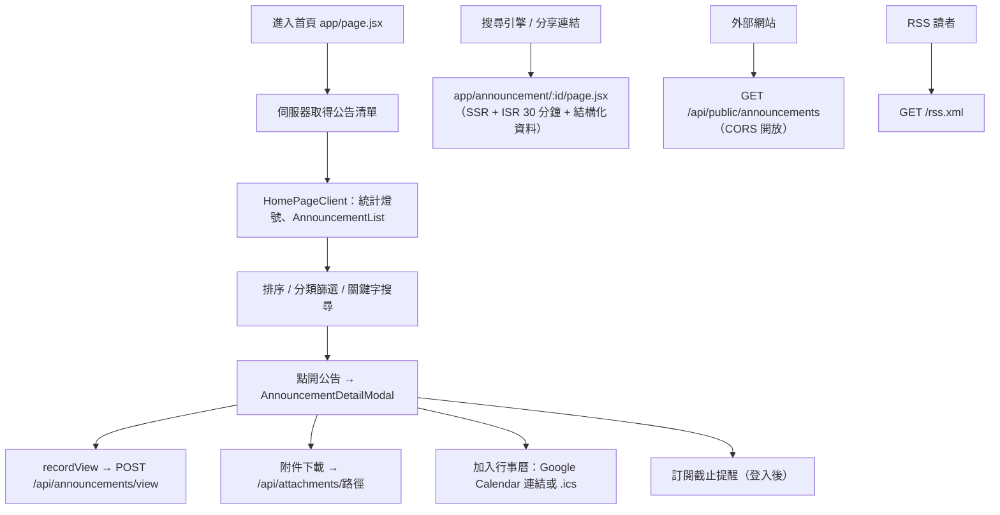

# 公告瀏覽與搜尋

## 目的

首頁列出獎學金公告，提供排序、篩選、關鍵字搜尋；點開公告可看詳情、下載附件、加入行事曆。同時提供 SEO 頁、RSS、Sitemap 與對外嵌入用的公開 API。

## 流程

## 涉及檔案

| 檔案 | 用途 |
|---|---|
| `apps/web/src/app/page.jsx`、`components/HomePageClient.jsx` | 首頁與統計燈號 |
| `apps/web/src/components/AnnouncementList.jsx` | 列表、排序、篩選、搜尋 |
| `apps/web/src/lib/announcementSearch.js` | 搜尋比對：先子字串，再逐字模糊比對 |
| `apps/web/src/components/AnnouncementDetailModal.jsx`、`HtmlRenderer.jsx` | 詳情與 HTML 內容渲染 |
| `apps/web/src/app/announcement/[id]/page.jsx` | 單篇 SSR 頁（`revalidate = 1800`，僅 `is_active` 公告，否則 404），含 `JsonLd.jsx` |
| `apps/web/src/app/api/announcements/view/route.js` | 瀏覽紀錄 |
| `apps/web/src/app/api/public/announcements/route.js` | 公開 JSON（`Cache-Control: s-maxage=600`），搭配 `api/public/widget.js` 嵌入小工具 |
| `apps/web/src/app/rss.xml/route.js`、`sitemap.ts`、`robots.ts` | RSS、Sitemap、robots |
| `apps/web/src/app/api/attachments/[...path]/route.js` | 附件下載，會正規化路徑防目錄穿越 |
| `packages/core/src/announcementUi.ts` | `CATEGORY_NAMES`、`getDeadlineInfo`、`buildGoogleCalendarUrl`、`buildIcsContent`（網頁與 App 共用） |
| `packages/core/src/publicAnnouncements.ts`、`lib/publicAnnouncements.js` | 公開公告抓取（App 使用） |

## 資料表

`announcements`（`is_active`、`category` A–G、`application_start_date`、`application_end_date`、`view_count` 等）、`attachments`、`announcement_views`。

## 換學校時要改的地方

- 公告分類名稱：`packages/core/src/announcementUi.ts` 的 `CATEGORY_NAMES`。
- 網站名稱、網址、連結：`packages/core/src/siteConfig.ts`。
- 首頁文案與 SEO 描述：`app/layout.jsx`、`manifest.js`。

## 容易忽略的行為

- 未啟用（`is_active = false`）的公告不會出現在 SSR 頁、Sitemap 與公開 API。
- 瀏覽數同一 IP 每小時只計一次（見 [數據統計.md](數據統計.md)）。
- 公開 API 與 RSS 有 CDN 快取（約 10～15 分鐘），後台改完內容不會立刻反映。
- `announcement/[id]` 是 ISR，內容約 30 分鐘後才重新生成。
