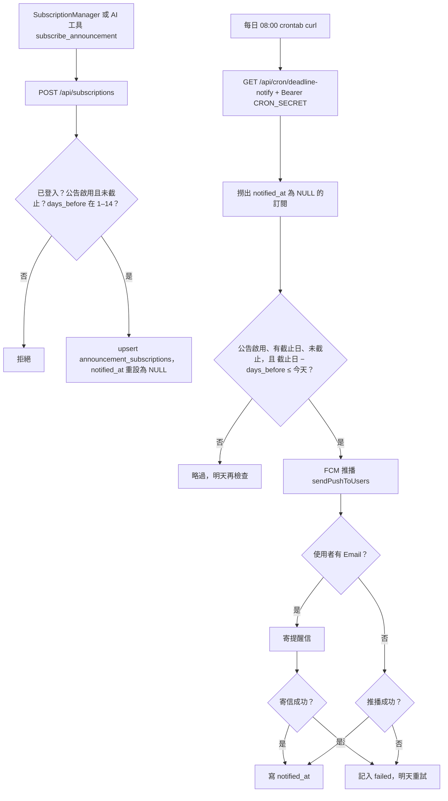

# 公告訂閱與截止提醒

## 目的

登入使用者可對某則公告設定「截止前 N 天提醒」，系統每天排程檢查，以 Email 與推播通知。AI 助理也可以代為訂閱（見 [AI工具與Agent迴圈.md](AI工具與Agent迴圈.md)）。

## 流程



## 涉及檔案

| 檔案 | 用途 |
|---|---|
| `apps/web/src/app/api/subscriptions/route.js` | `GET` 我的訂閱、`POST` 新增或更新、`DELETE` 取消；每 10 分鐘 30 次 |
| `apps/web/src/components/SubscriptionManager.jsx` | 訂閱 UI |
| `apps/web/src/app/api/cron/deadline-notify/route.js` | 每日排程，需 `Authorization: Bearer $CRON_SECRET` |
| `apps/web/src/lib/push.js` | `sendPushToUsers` |
| `apps/web/src/lib/emailTemplate.js` | 信件模板 |

## 資料表

- `announcement_subscriptions`：`user_id`、`announcement_id`、`days_before`、`notified_at`。
- `profiles`（取 Email、名稱）、`fcm_tokens`（推播裝置）。

## 部署設定

```
0 8 * * * curl -s -H "Authorization: Bearer $CRON_SECRET" http://localhost:3000/api/cron/deadline-notify
```

需要 `CRON_SECRET`、SMTP 設定，與（若要推播）Firebase 設定。

## 容易忽略的行為

- 提醒窗口是「進入窗口就寄一次」，不是「剛好那天」；排程晚跑一天仍會補寄，只要還沒過截止日。
- 已截止（`application_end_date < 今天`）的訂閱不會再提醒，也不會被標記。
- 推播與 Email 相互獨立，任一成功就會標記 `notified_at`；沒有 Email 的帳號只要推播成功就標記。
- 重新訂閱同一則公告會把 `notified_at` 重設，可再次收到提醒。
- 日期以 `Asia/Taipei` 計算。
- 排程需由主機自行呼叫（crontab 或雲端排程），程式本身不會自動執行。
