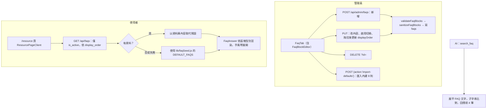

# 常見問答（FAQ）

## 目的

在「資源」頁提供圖文並茂的常見問答，管理員可在後台維護；同時是 AI 工具 `search_faq` 的資料來源，也是 [AI品質回饋循環.md](AI品質回饋循環.md) 的發佈目標。

## 流程



## 涉及檔案

| 檔案 | 用途 |
|---|---|
| `apps/web/src/app/api/faqs/route.js` | 公開讀取 |
| `apps/web/src/app/api/admin/faqs/route.js` | 管理員 CRUD 與 `import-defaults` |
| `apps/web/src/lib/faqBlocks.js` | `ALLOWED_FAQ_TYPES`、`validateFaqBlocks`、`sanitizeFaqBlocks` |
| `apps/web/src/lib/faqSeed.js` | `DEFAULT_FAQS`（原作者的 8 則內容，換學校需改寫） |
| `apps/web/src/components/admin/FaqTab.jsx`、`FaqBlockEditor.jsx` | 後台編輯與 framer-motion 拖拉排序 |
| `apps/web/src/components/FaqAnswer.jsx` | 前台渲染 |
| `apps/web/src/app/resource/ResourcePageClient.jsx` | 資源頁；另有「使用手冊」分頁，以 iframe 載入 `siteConfig.links.manual` |
| `apps/web/src/lib/ai/tools.js` | `search_faq` |

## 資料

`faqs`：`question`、`answer`（jsonb 區塊陣列）、`display_order`、`is_active`、`created_at`、`updated_at`。

答案區塊格式：

```json
[
  { "type": "paragraph", "text": "..." },
  { "type": "list",  "items": ["..."] },
  { "type": "steps", "items": ["..."] },
  { "type": "note",  "text": "..." },
  { "type": "warn",  "text": "..." }
]
```

## 驗證限制

- 型別只能是 `paragraph`、`list`、`steps`、`note`、`warn`。
- 區塊數上限 30；文字區塊 3000 字；清單每項 1000 字；問題 300 字。
- 行內語法：`**粗體**`、`==螢光標示==`、`[文字](網址)`，由 `FaqAnswer.jsx` 以前端解析，不接受任意 HTML。

## 容易忽略的行為

- 資料庫為空或讀取失敗時，前台自動顯示 `DEFAULT_FAQS`；因此新環境若沒匯入預設，仍會看到原作者的舊內容，需要改寫 `faqSeed.js`。
- `display_order` 是後台拖拉後由前端逐筆送 `PUT` 更新；發佈缺口時是「目前最大值 + 10」。
- `search_faq` 只做子字串比對，不是語意搜尋，關鍵字選得不準會找不到。
- 每個區塊型別的樣式改動要同步修改 `FaqAnswer.jsx` 與 `FaqBlockEditor.jsx`。
