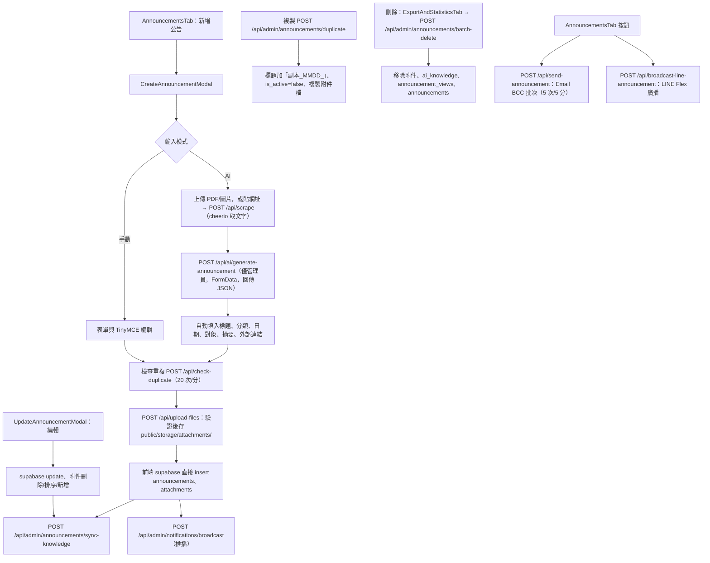

# 後台公告管理

## 目的

管理員新增、編輯、複製、刪除公告，管理附件，並在需要時以 Email、LINE、推播通知使用者。這是所有 AI 與 LINE 功能的資料來源。

## 流程

## 涉及檔案

| 檔案 | 用途 |
|---|---|
| `apps/web/src/components/admin/AnnouncementsTab.jsx` | 列表、搜尋、排序、寄 Email、廣播 LINE、同步知識庫、檢視知識內容 |
| `apps/web/src/components/CreateAnnouncementModal.jsx` | 新增（AI／手動）、複製 |
| `apps/web/src/components/UpdateAnnouncementModal.jsx` | 編輯、附件管理、複製、AI 優化 |
| `apps/web/src/components/DeleteAnnouncementModal.jsx` | 單筆刪除確認 |
| `apps/web/src/components/admin/ExportAndStatisticsTab.jsx` | 統計與批次刪除（例如逾期公告） |
| `apps/web/src/app/api/scrape/route.js` | 抓取網頁文字 |
| `apps/web/src/app/api/ai/generate-announcement/route.js` | Gemini 擷取公告欄位 |
| `apps/web/src/app/api/upload-files/route.js` | 上傳（10 次/分） |
| `apps/web/src/app/api/delete-files/route.js` | 刪除檔案（管理員） |
| `apps/web/src/app/api/check-duplicate/route.js` | 重複標題檢查 |
| `apps/web/src/app/api/admin/announcements/duplicate/route.js`、`batch-delete/route.js` | 複製、批次刪除 |
| `apps/web/src/app/api/send-announcement/route.js` | 公告 Email（每批 90 位 BCC） |
| `apps/web/src/app/api/broadcast-line-announcement/route.js` | LINE 廣播 |
| `apps/web/src/lib/emailTemplate.js`、`lib/line.js` | 信件與 LINE 訊息模板 |

## 資料表

- `announcements`：`title`、`summary`（HTML）、`category`、`application_start_date`、`application_end_date`、`target_audience`、`application_limitations`、`submission_method`、`external_urls`（JSON 陣列字串）、`is_active`、`view_count`。
- `attachments`：`announcement_id`（`ON DELETE CASCADE`）、`file_name`、`stored_file_path`、`file_size`、`mime_type`、`display_order`。
- `ai_knowledge`（見 [AI知識庫同步與檢索.md](AI知識庫同步與檢索.md)）、`announcement_views`。

## 上傳規則（`upload-files`）

- 只有 MIME 或副檔名其中之一在允許清單即通過（清單含 PDF、Word、Excel、ODT 等）。
- 單檔上限 15 MB。
- 檔名改為 `時間戳-序號-md5前8碼-隨機碼.副檔名`，存到 `public/storage/attachments/`，回傳 `/storage/attachments/...`。

## 容易忽略的行為

- 新增與編輯公告是前端直接透過 Supabase client 寫入，不經過伺服器 API；權限依賴資料庫 RLS 與管理員登入。
- 複製的公告預設下架（`is_active=false`），因此不會進 AI 知識庫，上架後才會同步。
- `batch-delete` 呼叫的是 Supabase Storage 的 `attachments` bucket 移除檔案，但上傳實際存於伺服器磁碟 `public/storage/attachments/`，兩者不一致，可能留下孤兒檔案，需要時請手動清理或修正。
- 公告 HTML（TinyMCE）以原樣儲存，前端以 `HtmlRenderer` 渲染，沒有在 API 層做 HTML 淨化。
- AI 產生失敗不會阻擋新增，可改用手動模式。
- 寄 Email 與 LINE 廣播是獨立按鈕，新增公告時不會自動觸發，只有推播與知識庫同步會自動觸發。
- 若要讓 LINE 管理者以對話新增公告，見 [../LINE管理者新增公告開發指南.md](../LINE管理者新增公告開發指南.md)。
