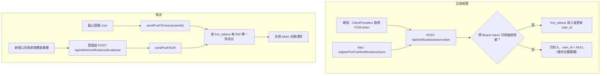

# 推播通知（FCM）

## 目的

透過 Firebase Cloud Messaging 對網頁（Service Worker）與 App（Expo）裝置推播：截止提醒（一對一）與管理員廣播（全體）。

## 流程

## 涉及檔案

| 檔案 | 用途 |
|---|---|
| `apps/web/src/lib/firebase.js` | 瀏覽器端 Firebase 初始化與取得 token（`NEXT_PUBLIC_FIREBASE_*`、`NEXT_PUBLIC_FIREBASE_VAPID_KEY`） |
| `apps/web/src/lib/firebase-admin.js` | 伺服器端 Admin SDK（`FIREBASE_PROJECT_ID`、`FIREBASE_CLIENT_EMAIL`、`FIREBASE_PRIVATE_KEY`） |
| `apps/web/src/lib/push.js` | `sendPushToTokens`、`sendPushToUsers`、`sendPushToAll` |
| `apps/web/src/components/ClientProviders.jsx` | 網頁端註冊 token |
| `apps/web/public/sw.js` | 背景訊息與點擊處理 |
| `apps/web/src/app/api/notifications/save-token/route.js` | 儲存裝置 token |
| `apps/web/src/app/api/admin/notifications/broadcast/route.js` | 管理員全體廣播 |
| `apps/web/src/components/admin/SendNotificationModal.jsx` | 後台發送介面 |
| `apps/mobile/src/lib/notifications.ts`、`google-services.json` | App 端註冊與 Firebase 設定 |

## 資料表

`fcm_tokens`：`fcm_token`、`user_id`（可為 NULL）、`device_type`（預設 `web`）。建立於 migration `20260405000000_add_fcm_tokens.sql`。

## 換學校時要做的事

- 建立自己的 Firebase 專案，取得 Web 設定、VAPID key、服務帳戶金鑰。
- 更換 `apps/mobile/google-services.json` 與 `apps/web/public/` 中的 Firebase 設定（Service Worker 內可能也有寫死設定，需一併確認）。
- 沒設定 Firebase 時，推播功能無法運作，其餘功能不受影響。

## 容易忽略的行為

- `save-token` 不強制登入；沒有身分的 token 只能收到全體廣播，收不到截止提醒。
- 同一台裝置換人登入時，會把既有 token 的 `user_id` 改成新使用者。
- `FIREBASE_PRIVATE_KEY` 內的 `\n` 會在程式中還原成換行，放環境變數時保持跳脫字元即可。
- 推播失敗不會中斷主流程（截止提醒中，推播與 Email 各自獨立）。
