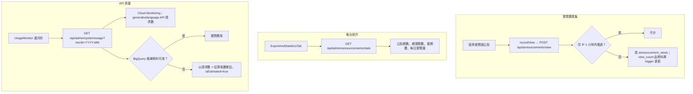

# 數據統計

## 目的

後台顯示公告瀏覽統計、逾期公告數，以及 Gemini API 每月呼叫量與費用。

## 流程

## 涉及檔案

| 檔案 | 用途 |
|---|---|
| `apps/web/src/app/api/announcements/view/route.js` | 記錄瀏覽（不需登入） |
| `apps/web/src/app/api/admin/announcements/stats/route.js` | 公告統計（管理員） |
| `apps/web/src/app/api/admin/system/usage/route.js` | Gemini 用量與費用（管理員） |
| `apps/web/src/components/admin/ExportAndStatisticsTab.jsx` | 統計圖表與匯出 |
| `apps/web/src/components/admin/UsageMonitor.jsx` | 用量圖表 |

## 統計規則

- 逾期公告：`application_end_date` 早於「現在往前 2 年」；沒有截止日則以 `created_at` 判斷。
- 每日瀏覽量：以 `announcement_views.viewed_at` 依 UTC 日期分組。
- 用量：`serviceruntime.googleapis.com/api/request_count`，過濾 `generativelanguage.googleapis.com`。
- 費用：BigQuery 帳單匯出表（`GCP_BILLING_TABLE_ID` 需為 `project.dataset.table`，可搭配 `GCP_BILLING_LOCATION`）；查不到時以 `ESTIMATION_FACTOR_USD = 0.0056` 乘上請求數推估，係數寫死在程式內，是依原作者實際帳單換算，換學校後應調整。

## 資料表與設定

- `announcements.view_count`、`announcement_views`（`announcement_id`、`ip_address`、`viewed_at`）。
- `GCP_SERVICE_ACCOUNT_JSON`（可在後台設定）、`GCP_BILLING_TABLE_ID`、`GCP_BILLING_LOCATION`。未設定服務帳戶時，用量功能無法使用，其他統計不受影響。

## 容易忽略的行為

- `stats` 一次撈出所有公告與所有瀏覽紀錄再在程式內彙整，資料量很大時會變慢。
- 用量統計只計平台金鑰（Cloud 專案）的呼叫；使用者自備金鑰不會出現在你的專案用量內。
- BigQuery 帳單匯出通常有延遲，當月數字可能偏低。
