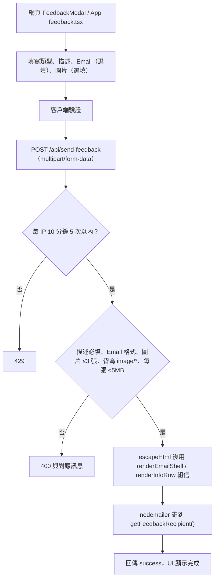

# 站內問題回報

## 目的

讓使用者（不需登入）從網頁或 App 回報介面錯誤、公告資料錯誤或功能建議，系統以 Email 轉寄給管理團隊。沒有資料庫儲存，也沒有工單追蹤。

## 流程

## 表單欄位

| 欄位 | 說明 |
|---|---|
| `type` | 介面顯示問題／公告資料錯誤／功能建議／其他 |
| `description` | 必填；伺服器端截斷至 5000 字（App 端限制 2000 字） |
| `email` | 選填，供回覆；有填則需符合基本 Email 格式 |
| `page` | 網頁為目前網址；App 固定為 `mobile-app` |
| `images` | 最多 3 張，每張小於 5 MB，僅圖片 |

信件主旨為 `【平台問題回報】{type}`，內文含時間（Asia/Taipei）與 User-Agent。

## 涉及檔案

| 檔案 | 用途 |
|---|---|
| `apps/web/src/components/FeedbackModal.jsx` | 網頁表單、拖放與預覽 |
| `apps/mobile/app/feedback.tsx` | App 表單 |
| `apps/web/src/app/api/send-feedback/route.js` | 驗證與寄信，含 `escapeHtml` |
| `apps/web/src/lib/apiMiddleware.js` | `checkRateLimit`（依 IP 分桶） |
| `apps/web/src/lib/emailTemplate.js` | `renderEmailShell`、`renderInfoRow` |
| `packages/core/src/siteConfig.ts` | `getFeedbackRecipient()`：`FEEDBACK_EMAIL`，其次 `SENDER_EMAIL` |

## 設定

`SMTP_HOST`、`SMTP_PORT`（465 會自動使用 SSL）、`SMTP_USERNAME`、`SMTP_PASSWORD`、`SENDER_EMAIL`、`SENDER_NAME`、`FEEDBACK_EMAIL`（可選，未設就寄給 `SENDER_EMAIL`）。

## 安全

- 端點公開，僅以速率限制與輸入驗證防濫用。
- 使用者輸入在放入信件前一律 `escapeHtml`，避免信件 HTML 注入。
- 客戶端與伺服器端都驗證圖片型別與大小，以伺服器端為準。

## 容易忽略的行為

- 沒有寄件紀錄，信箱就是唯一的保存處；SMTP 失敗時使用者只會看到錯誤，內容不會被暫存。
- 速率限制是程序內記憶體計數，多程序或重啟後會重置。
- 使用者填的 Email 會放在內文並設為信件的 `Reply-To`，管理員可直接回信；該 Email 未經驗證，不可當作可信身分。
- 沒有登入也能送出，因此垃圾訊息風險取決於速率限制與 SMTP 寄件額度。
