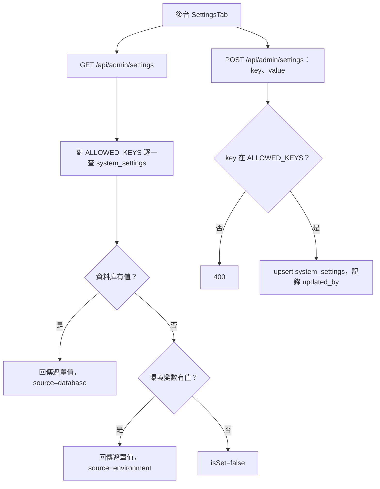

# 系統設定

## 目的

讓管理員在後台修改金鑰與開關（Gemini、LINE、AI 開關等），不必重啟服務或改 `.env`。

## 流程

## 讀取優先序

`getSystemConfig(key)`（`lib/config.js`）：`system_settings`（資料庫）優先，其次 `process.env`。`GEMINI_API_KEY` 另外會回退到 `NEXT_PUBLIC_GEMINI_API_KEY`。

## 可在後台修改的 key（`ALLOWED_KEYS`）

| Key | 用途 |
|---|---|
| `GEMINI_API_KEY` | 平台共用的 Gemini 金鑰 |
| `SERP_API_KEY` | AI 網路搜尋（SerpApi） |
| `NEXT_PUBLIC_TINYMCE_API_KEY` | 公告編輯器 |
| `GCP_SERVICE_ACCOUNT_JSON` | 用量與帳單查詢用的 GCP 服務帳戶 |
| `AI_ASSISTANT_ENABLED` | 網頁 AI 助理總開關（不遮罩） |
| `LINE_CHANNEL_ACCESS_TOKEN`、`LINE_CHANNEL_SECRET` | LINE Messaging API |
| `LINE_AI_AUTO_REPLY_ENABLED` | LINE AI 自動回覆開關（不遮罩） |
| `LINE_AI_REPLY_SCHEDULE` | LINE AI 回應時段（JSON：`enabled`、`days`、`offHoursMessage`） |

## 不在後台、只能放環境變數的設定

| 變數 | 用途 |
|---|---|
| `NEXT_PUBLIC_SUPABASE_URL`、`NEXT_PUBLIC_SUPABASE_ANON_KEY`、`SUPABASE_SERVICE_ROLE_KEY` | Supabase |
| `SMTP_HOST`、`SMTP_PORT`、`SMTP_USERNAME`、`SMTP_PASSWORD`、`SENDER_EMAIL`、`SENDER_NAME` | 寄信 |
| `FEEDBACK_EMAIL` | 問題回報收件者 |
| `CRON_SECRET` | 截止提醒排程驗證 |
| `FIREBASE_*`、`NEXT_PUBLIC_FIREBASE_*` | 推播 |
| `LINE_LOGIN_CHANNEL_ID`、`LINE_LOGIN_CHANNEL_SECRET` | LINE Login 綁定（僅讀環境變數） |
| `API_KEY_ENCRYPTION_SECRET` | 使用者雲端金鑰加密（見 `lib/secretBox.js`） |
| `GCP_BILLING_TABLE_ID`、`GCP_BILLING_LOCATION` | 由 `getSystemConfig` 讀取，因不在 `ALLOWED_KEYS`，實務上放環境變數或直接寫進 `system_settings` |

## 涉及檔案

| 檔案 | 用途 |
|---|---|
| `apps/web/src/app/api/admin/settings/route.js` | 讀寫設定 |
| `apps/web/src/lib/config.js` | `getSystemConfig`、`setSystemConfig`、`getPublicSystemConfig` |
| `apps/web/src/app/api/settings/public/route.js` | 前端可讀的公開設定（TinyMCE key、`AI_ASSISTANT_ENABLED`；未設定時預設啟用） |
| `apps/web/src/components/admin/SettingsTab.jsx` | 設定 UI，含「同步 AI 知識庫」按鈕 |
| `apps/web/src/components/admin/UsageMonitor.jsx` | 用量顯示 |

## 資料表

`system_settings`：`key`（唯一）、`value`、`updated_at`、`updated_by`。

`setSystemConfig` 也供程式內部寫入狀態，例如品質評估游標 `AI_QUALITY_LAST_EVAL_AT`（見 [AI品質回饋循環.md](AI品質回饋循環.md)）。

## 容易忽略的行為

- 回傳給前端的敏感值一律遮罩（前 3 碼＋`******`＋後 4 碼；8 碼以下全遮）。
- 後台寫入的是明文，存在 `system_settings`；只有使用者自備金鑰會經 AES-256-GCM 加密。
- `setSystemConfig` 不檢查權限，僅限伺服器端程式碼呼叫。
- 資料庫有值就會蓋過環境變數；要回到環境變數需清空該列的值。
