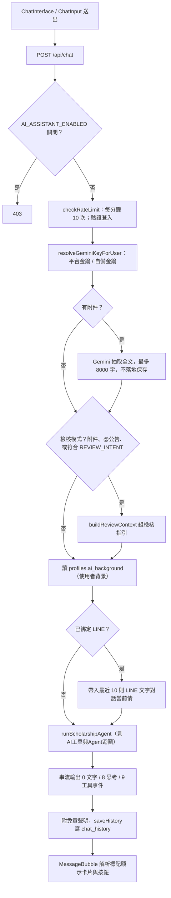

# 網頁 AI 助理

## 目的

在 `/ai-assistant` 提供串流式對話，回答獎學金問題、推薦公告、檢核申請文件，並可代為訂閱提醒。

## 流程

## 串流格式

回應為純文字串流（`x-vercel-ai-data-stream: v1`），每行 `<代碼>:<JSON>`：

| 代碼 | 內容 |
|---|---|
| `0` | 回答文字片段 |
| `8` | 思考（thinking）片段 |
| `9` | 工具呼叫事件（前端顯示「正在搜尋…」等） |

回應標頭有 `X-Accel-Buffering: no`，避免 nginx 緩衝導致文字一次跳出。

## 特殊標記（由模型輸出，前端解析）

| 標記 | 前端行為 |
|---|---|
| `[ANNOUNCEMENT_CARD:id1,id2]` | 顯示公告推薦卡（最多 3 筆） |
| `[SUBSCRIBE_CONFIRM:id:天數]` | 顯示「確認訂閱」按鈕，由使用者點擊才真正訂閱 |
| `[MEMORY_CONFIRM:項目1|項目2]` | 顯示「加入記憶庫」按鈕；存入歷史前會被移除 |

## 涉及檔案

| 檔案 | 用途 |
|---|---|
| `apps/web/src/app/ai-assistant/page.jsx`、`AiAssistantClient.jsx` | 頁面與狀態 |
| `apps/web/src/components/ai-assistant/ChatInterface.jsx`、`ChatInput.jsx`、`MessageBubble.jsx`、`AnnouncementCard.jsx` | 對話 UI、標記解析 |
| `apps/web/src/app/api/chat/route.js` | 主端點 |
| `apps/web/src/app/api/chat/feedback/route.js` | 使用者對回答按讚／倒讚（每分鐘 30 次），寫 `ai_message_feedback` |
| `apps/web/src/app/api/chat-history/route.js` | 歷史 `GET`（60/分）、`POST`（100/分）、`DELETE` 清除（5/分） |
| `apps/web/src/app/api/users/background/route.js`、`background/merge/route.js` | 使用者背景資料（記憶庫）讀寫與合併 |
| `apps/web/src/lib/ai/agent.js`、`tools.js`、`reviewGuide.js`、`memory.js`、`models.js` | 見對應文件 |

## 資料表與設定

- `chat_history`：`user_id`、`session_id`、`role`（user / model / system）、`message_content`、`timestamp`。
- `profiles.ai_background`：使用者背景（上限 1000 字）。
- `line_users`、`line_messages`：跨渠道前情。
- `ai_message_feedback`：回饋。
- `system_settings.AI_ASSISTANT_ENABLED`、`GEMINI_API_KEY`。

## 容易忽略的行為

- 「清除紀錄」是寫入一筆 `role='system'`、內容 `__HISTORY_CLEARED__` 的標記；LINE 前情只取標記時間之後的對話。
- 附件（PDF、PNG、JPEG、WebP、純文字，10 MB 內）只用於當次對話，歷史只存原始提問與檔名，不存抽取全文。
- 上傳附件、以 `@` 指定公告，或提問符合 `REVIEW_INTENT`（檢核、申請書、自傳…）一律進入檢核模式；`body.mode` 為 `general` 可強制關閉關鍵字判斷。
- 回答最後會自動附加免責聲明（僅在有實際回答時）。
- 校外使用者金鑰失效或額度用盡時，會回傳具體指引訊息而不是泛用錯誤。
- 模型名稱集中在 `lib/ai/models.js` 的 `GEMINI_MODEL`。
